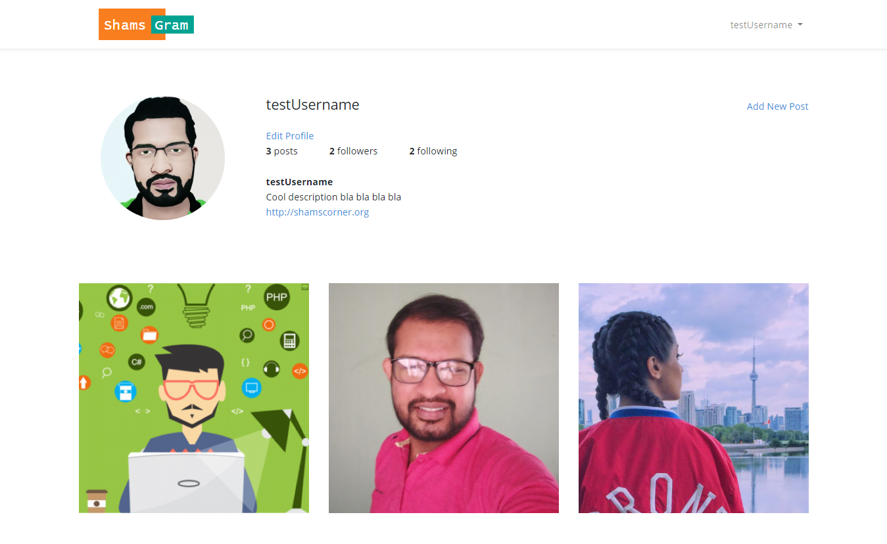
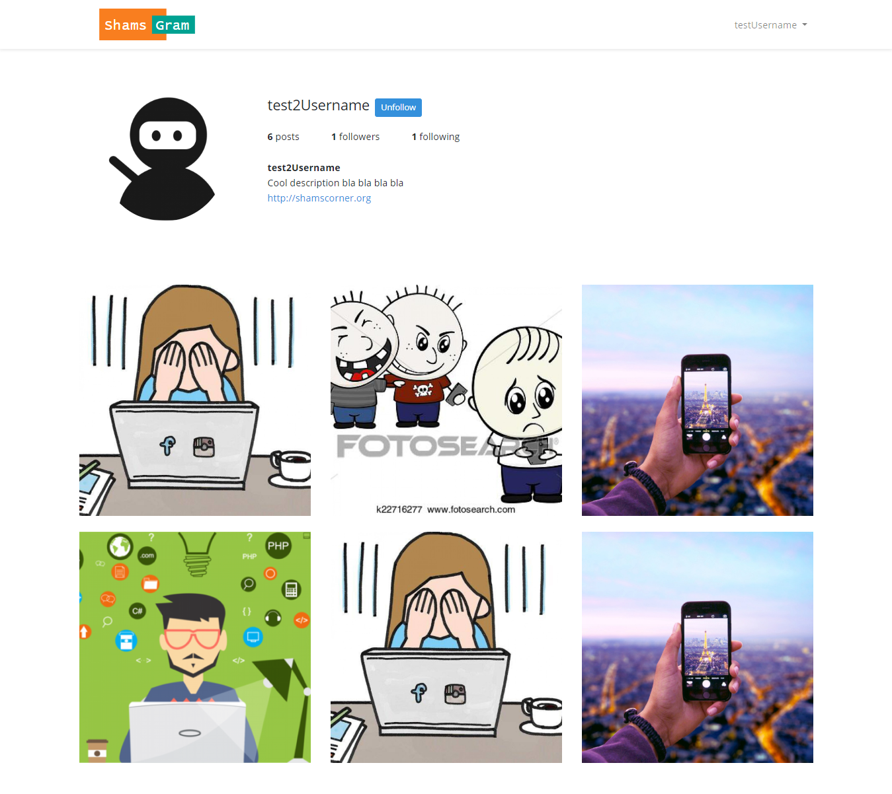
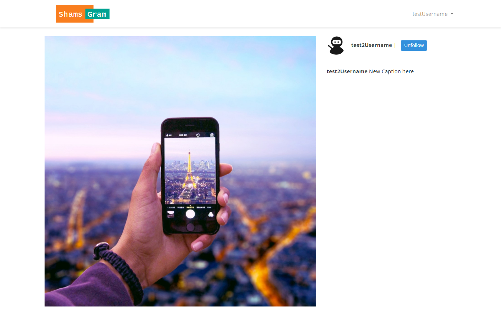
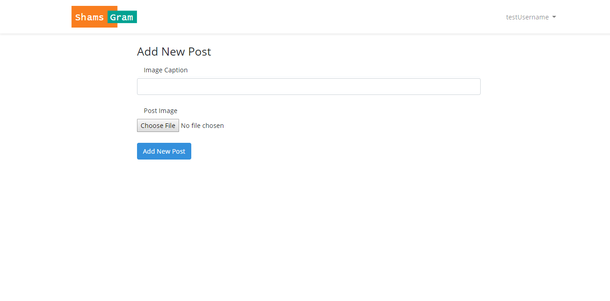
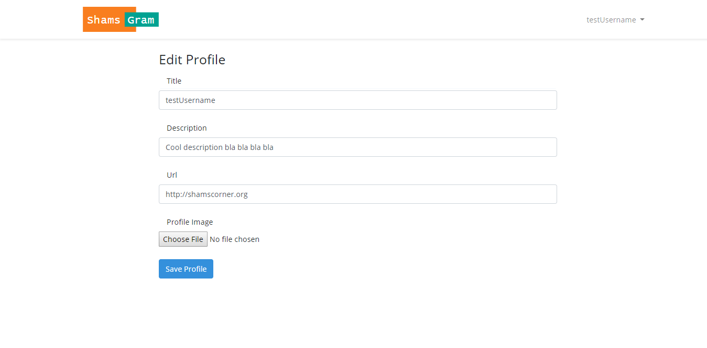

# shamsgram
### A fully functional Instagram clone using Laravel &amp; Vue.js

This is a fully functional clone of the Instagram website, where a user can see his/her profile, corresponding posts, 
and create them. Users can also navigate through all the following and follower's public profiles. 
Moreover, they can follow any user if they want and browse the posts on their homepage who are followed by them.

* how to build a RESTful web application
* how to make a strict authentication system (CRUD)
* working with Intervention Image PHP Library
* optimizing the expensive query by the help of laravel caching
* sending notification and alert to the user
* attaching Vue component and increase dynamicity

**User Profile Page with some posts**

**User can follow or unfollow another user but can not edit them**

**User can see other's post and follow them**

**User can add new post**

**User can update an existing post**

Thank you very much! :simple_smile:
* **Name:** Shamim Hossain
* **Email:** hossains159@gmail.com
* **Facebook:** https://www.facebook.com/shamscorner
* **Linkedin:** https://www.linkedin.com/in/shamscorner/
